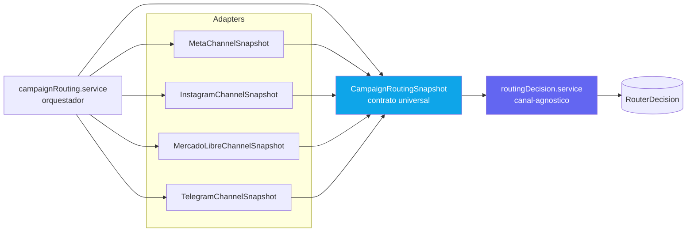

# AI Routing Decision Engine

Arquitectura **rule-first** para tomar decisiones con IA de forma segura,
auditable y con control de costos.

La idea central:

```txt
La IA propone.
La plataforma valida.
El executor solo ejecuta decisiones validadas.
```

Este proyecto documenta un patron para plataformas que usan IA para decidir
acciones con impacto real: envios, publicaciones, automatizaciones, respuestas,
campañas, flujos operativos o consumo de APIs externas.

## Flujo principal


## Arquitectura multicanal



> Para agregar un canal nuevo: crear el adapter correspondiente. El core no cambia.

## Por que existe

Muchos sistemas conectan la IA directamente con la ejecucion:

```txt
usuario pide algo
  -> modelo decide
  -> sistema ejecuta
```

Ese enfoque puede ser peligroso cuando la accion:

- genera costo variable;
- consume APIs pagas;
- envia mensajes;
- publica contenido;
- afecta reputacion;
- requiere consentimiento;
- necesita aprobacion humana;
- puede duplicarse;
- puede violar limites del plan;
- toca canales experimentales o sensibles.

El objetivo de esta arquitectura es evitar ese acoplamiento directo.

## Principio de diseno

No usar IA si una regla, cache o herramienta deterministica puede resolver bien.

Orden recomendado:

```txt
Rule Engine / Policy Engine
  -> Decision Cache
  -> AI Router si aporta valor
  -> Schema Validator
  -> Business Validator
  -> Approval Workflow
  -> Executor
  -> Audit / Billing / Outbox
```

Nunca:

```txt
AI Router -> Executor directo
```

## Que resuelve

Esta estructura ayuda a:

- reducir gasto de tokens;
- reducir costos accidentales en APIs externas;
- bloquear acciones no permitidas por reglas duras;
- validar respuestas de IA con JSON Schema;
- usar fallbacks conservadores;
- pedir aprobacion humana cuando corresponde;
- auditar cada decision;
- medir costo por tenant, feature, proveedor y modelo;
- separar recomendacion, validacion y ejecucion.

## Componentes principales

### Rule Engine / Policy Engine

Evalua reglas duras antes de llamar a la IA.

Ejemplos:

```txt
plan no permite la accion -> block
saldo insuficiente -> block
usuario sin permiso -> block
canal desconectado -> block
opt-out activo -> block
feature flag apagada -> block
aprobacion requerida y no aprobada -> block
```

La IA no puede ignorar estas reglas.

### AI Router

Optimiza dentro de lo permitido.

Puede sugerir:

```txt
tandas
demoras
orden recomendado
riesgo
explicacion
aprobacion requerida
alternativa mas barata
```

No puede decidir:

```txt
ignorar limites del plan
enviar sin saldo
usar un canal no habilitado
ejecutar sin aprobacion
usar un canal experimental como fallback automatico
```

### Schema Validator

Valida que la salida del modelo respete un JSON Schema estricto.

Si falla:

```txt
no ejecutar
reintentar como maximo una vez
usar fallback conservador si vuelve a fallar
registrar el error
```

### Business Validator

Vuelve a validar despues de la IA.

Chequea:

```txt
plan
limites
saldo
reserva de costo
permisos
feature flags
estado del canal
estado del proveedor
consentimiento
opt-out
horarios permitidos
aprobaciones
circuit breakers
idempotencia
expiracion de la decision
```

Aunque la IA devuelva `allow`, el Business Validator puede convertir la decision
en `block` o `require_approval`.

### Executor

Solo ejecuta decisiones validadas.

Debe recibir una decision ya cerrada:

```txt
decisionId
channel
provider
destination
payload
scheduledFor
idempotencyKey
correlationId
costReservationId
```

No deberia recalcular la decision.

## Estructura sugerida

```txt
src/
  decisioning/
    models/
      RouterDecision.model
    schemas/
      routerDecision.schema
    services/
      routingDecision.service
      ruleOnlyFallback.service
      businessValidator.service
  routing/
    campaignRouting.service          <- orquestador, canal-agnostico
    CampaignRoutingSnapshot          <- contrato universal
    adapters/
      MetaChannelSnapshot            <- primer canal oficial
      InstagramChannelSnapshot       <- futuro
      MercadoLibreChannelSnapshot    <- futuro
      TelegramChannelSnapshot        <- futuro
  policy/
    policy.engine
    policies/
      routerAi/
        optOut.policy
        channelConnected.policy
        channelBalance.policy
        planLimits.policy
        riskGates.policy
        experimentalChannel.policy
  approvals/
    approval.service
  costs/
    {canal}CostEstimator.service
    {canal}Balance.service
  ai/
    providerSelector.service
    decisionCache.service
    usageLedger.service
    circuitBreaker.service
```

## RouterDecision

Modelo recomendado para auditar cada decision.

Campos sugeridos:

```txt
clientId
sourceModule
sourceType
sourceId
decisionId
mode
state
decision
riskLevel
inputHash
contextHash
schemaVersion
policyVersion
promptVersion
provider
model
tokensInput
tokensOutput
estimatedAiCostUSD
estimatedCostARS
requiresApproval
approvalRequestId
expiresAt
summary
reasonCodes
rulesApplied
batches
perDestinationDecisions
blockedDestinations
requiredActions
costReservation
cacheHit
fallbackUsed
rawOutput
validatedOutput
businessValidationResult
correlationId
causationId
idempotencyKey
createdAt
updatedAt
```

Estados sugeridos:

```txt
requested
rule_checked
cache_hit
ai_requested
ai_decided
schema_validated
business_validated
approval_pending
approved
routable
blocked
expired
failed
cancelled
```

## Fallback conservador

Cuando la IA falla o no esta disponible:

```txt
si reglas duras bloquean:
  decision = block

si riesgo bajo y reglas duras pasan:
  decision = allow
  usar tandas minimas
  usar delays conservadores

si riesgo medio:
  decision = require_approval

si riesgo alto o critico:
  decision = block
```

## Canales experimentales

Si una plataforma tiene canales experimentales, no oficiales o sensibles, el
Decision Engine debe tratarlos como excepciones controladas.

Reglas:

```txt
experimentalChannelEnabled debe ser true
tenant debe tener habilitacion admin/root
tenant debe aceptar terminos especificos
si los terminos vencen o cambian, bloquear
no usar canal experimental como fallback automatico
no usar canal experimental solo para evitar costo de un canal oficial
no permitir modo enforced hasta que exista una decision explicita de producto
```

## Modos de rollout

### simulation

Calcula costo y riesgo, pero no afecta ejecucion.

### advisory

Muestra recomendacion, puede pedir aprobacion, pero no ejecuta solo.

### shadow

Compara la decision real contra la decision IA sin afectar produccion.

### enforced

Solo para canales estables. Requiere schema validator, business validator,
idempotencia, decision vigente y reserva de costo si aplica.

## Checklist de implementacion

Primer corte:

- Crear `RouterDecision.model`.
- Crear `routerDecision.schema`.
- Crear `ruleOnlyFallback.service`.
- Crear `routingDecision.service`.
- Crear adaptador por dominio, por ejemplo `campaignRouting.service`.
- Crear `CampaignRoutingSnapshot` con contrato universal.
- Crear primer `ChannelSnapshot` adapter para el canal oficial.
- Integrar Policy Engine con scope dedicado para routing.
- Integrar Decision Cache.
- Integrar Provider Selector.
- Integrar Usage Ledger.
- Integrar Cost Estimator.
- Integrar Approvals.
- Exponer endpoint de simulacion.
- Mostrar decision en UI.

Segundo corte:

- Agregar EventOutbox.
- Agregar metricas.
- Agregar dashboard de decisiones.
- Agregar shadow mode.
- Agregar alertas de costo.
- Agregar Business Validator mas completo.

Tercer corte:

- Activar advisory para tenants beta.
- Activar enforced solo en canales oficiales o estables.
- Mantener canales experimentales en advisory/shadow.
- Agregar nuevos `ChannelSnapshot` adapters para canales adicionales.

## Documento completo

La version extendida esta en:

[AI-Routing-Decision-Engine.md](./AI-Routing-Decision-Engine.md)

## Licencia

MIT.

## Regla final

```txt
Las reglas deciden qué está permitido.
La IA optimiza lo que está permitido.
Los validadores deciden qué puede ejecutarse.
Los ejecutores solo ejecutan decisiones validadas.
```
