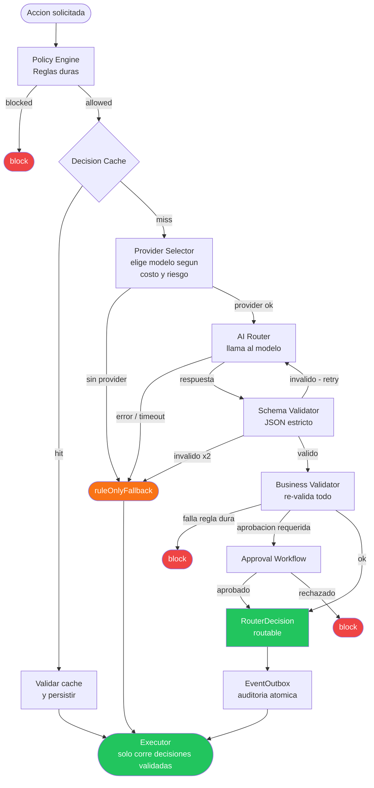
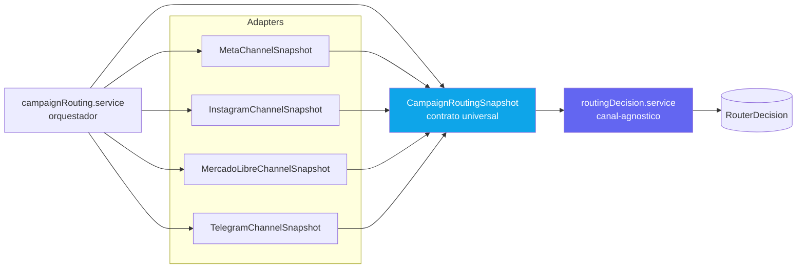

# AI Routing Decision Engine

Arquitectura **rule-first** para tomar decisiones con IA de forma segura,
auditable y con control de costos.

La idea central:

```txt
La IA propone.
La plataforma valida.
El executor solo ejecuta decisiones validadas.
```

Este proyecto documenta un patron para plataformas que usan IA para decidir
acciones con impacto real: envios, publicaciones, automatizaciones, respuestas,
campañas, flujos operativos o consumo de APIs externas.

## Inicio rapido

No requiere base de datos ni API keys. Todo corre en memoria.

```bash
git clone https://github.com/cristiandkzk/AI-Routing-Decision-Engine.git
cd AI-Routing-Decision-Engine
npm install
npm run simulate   # 12 casos de prueba con output en consola
npm test           # 71 tests unitarios e integracion
```

## Flujo principal



## Arquitectura multicanal



> Para agregar un canal nuevo: crear el adapter correspondiente. El core no cambia.

## Por que existe

Muchos sistemas conectan la IA directamente con la ejecucion:

```txt
usuario pide algo
  -> modelo decide
  -> sistema ejecuta
```

Ese enfoque puede ser peligroso cuando la accion:

- genera costo variable;
- consume APIs pagas;
- envia mensajes;
- publica contenido;
- afecta reputacion;
- requiere consentimiento;
- necesita aprobacion humana;
- puede duplicarse;
- puede violar limites del plan;
- toca canales experimentales o sensibles.

El objetivo de esta arquitectura es evitar ese acoplamiento directo.

## Principio de diseno

No usar IA si una regla, cache o herramienta deterministica puede resolver bien.

Orden recomendado:

```txt
Rule Engine / Policy Engine
  -> Decision Cache
  -> AI Router si aporta valor
  -> Schema Validator
  -> Business Validator
  -> Approval Workflow
  -> Executor
  -> Audit / Billing / Outbox
```

Nunca:

```txt
AI Router -> Executor directo
```

## Que resuelve

Esta estructura ayuda a:

- reducir gasto de tokens;
- reducir costos accidentales en APIs externas;
- bloquear acciones no permitidas por reglas duras;
- validar respuestas de IA con JSON Schema;
- usar fallbacks conservadores;
- pedir aprobacion humana cuando corresponde;
- auditar cada decision;
- medir costo por tenant, feature, proveedor y modelo;
- separar recomendacion, validacion y ejecucion.

## Componentes principales

### Rule Engine / Policy Engine

Evalua reglas duras antes de llamar a la IA.

Ejemplos:

```txt
plan no permite la accion -> block
saldo insuficiente -> block
usuario sin permiso -> block
canal desconectado -> block
opt-out activo -> block
feature flag apagada -> block
aprobacion requerida y no aprobada -> block
```

La IA no puede ignorar estas reglas.

### AI Router

Optimiza dentro de lo permitido.

Puede sugerir:

```txt
tandas
demoras
orden recomendado
riesgo
explicacion
aprobacion requerida
alternativa mas barata
```

No puede decidir:

```txt
ignorar limites del plan
enviar sin saldo
usar un canal no habilitado
ejecutar sin aprobacion
usar un canal experimental como fallback automatico
```

### Schema Validator

Valida que la salida del modelo respete un JSON Schema estricto.

Si falla:

```txt
no ejecutar
reintentar como maximo una vez
usar fallback conservador si vuelve a fallar
registrar el error
```

### Business Validator

Vuelve a validar despues de la IA.

Chequea:

```txt
plan
limites
saldo
reserva de costo
permisos
feature flags
estado del canal
estado del proveedor
consentimiento
opt-out
horarios permitidos
aprobaciones
circuit breakers
idempotencia
expiracion de la decision
```

Aunque la IA devuelva `allow`, el Business Validator puede convertir la decision
en `block` o `require_approval`.

### Executor

Solo ejecuta decisiones validadas.

Debe recibir una decision ya cerrada:

```txt
decisionId
channel
provider
destination
payload
scheduledFor
idempotencyKey
correlationId
costReservationId
```

No deberia recalcular la decision.

## Estructura sugerida

```txt
src/
  decisioning/
    models/
      RouterDecision.model
    schemas/
      routerDecision.schema
    services/
      routingDecision.service
      ruleOnlyFallback.service
      businessValidator.service
  routing/
    campaignRouting.service          <- orquestador, canal-agnostico
    CampaignRoutingSnapshot          <- contrato universal
    adapters/
      MetaChannelSnapshot            <- primer canal oficial
      InstagramChannelSnapshot       <- futuro
      MercadoLibreChannelSnapshot    <- futuro
      TelegramChannelSnapshot        <- futuro
  policy/
    policy.engine
    policies/
      routerAi/
        optOut.policy
        channelConnected.policy
        channelBalance.policy
        planLimits.policy
        riskGates.policy
        experimentalChannel.policy
  approvals/
    approval.service
  costs/
    {canal}CostEstimator.service
    {canal}Balance.service
  ai/
    providerSelector.service
    decisionCache.service
    usageLedger.service
    circuitBreaker.service
```

## RouterDecision

Modelo recomendado para auditar cada decision.

Campos sugeridos:

```txt
clientId
sourceModule
sourceType
sourceId
decisionId
mode
state
decision
riskLevel
inputHash
contextHash
schemaVersion
policyVersion
promptVersion
provider
model
tokensInput
tokensOutput
estimatedAiCostUSD
estimatedCostARS
requiresApproval
approvalRequestId
expiresAt
summary
reasonCodes
rulesApplied
batches
perDestinationDecisions
blockedDestinations
requiredActions
costReservation
cacheHit
fallbackUsed
rawOutput
validatedOutput
businessValidationResult
correlationId
causationId
idempotencyKey
createdAt
updatedAt
```

Estados sugeridos:

```txt
requested
rule_checked
cache_hit
ai_requested
ai_decided
schema_validated
business_validated
approval_pending
approved
routable
blocked
expired
failed
cancelled
```

## Fallback conservador

Cuando la IA falla o no esta disponible:

```txt
si reglas duras bloquean:
  decision = block

si riesgo bajo y reglas duras pasan:
  decision = allow
  usar tandas minimas
  usar delays conservadores

si riesgo medio:
  decision = require_approval

si riesgo alto o critico:
  decision = block
```

## Canales experimentales

Si una plataforma tiene canales experimentales, no oficiales o sensibles, el
Decision Engine debe tratarlos como excepciones controladas.

Reglas:

```txt
experimentalChannelEnabled debe ser true
tenant debe tener habilitacion admin/root
tenant debe aceptar terminos especificos
si los terminos vencen o cambian, bloquear
no usar canal experimental como fallback automatico
no usar canal experimental solo para evitar costo de un canal oficial
no permitir modo enforced hasta que exista una decision explicita de producto
```

## Modos de rollout

### simulation

Calcula costo y riesgo, pero no afecta ejecucion.

### advisory

Muestra recomendacion, puede pedir aprobacion, pero no ejecuta solo.

### shadow

Compara la decision real contra la decision IA sin afectar produccion.

### enforced

Solo para canales estables. Requiere schema validator, business validator,
idempotencia, decision vigente y reserva de costo si aplica.

## Estructuras necesarias

Antes de implementar el motor estas estructuras deben existir:

**Modelos / schemas**
- `RouterDecision` — persistencia de cada decision con su state machine.
- `EventOutbox` — cola de eventos atomica con RouterDecision.
- `ApprovalRequest` — solicitudes de aprobacion humana.
- `RouterDecision.schema` — JSON Schema estricto del output de IA.

**Servicios de infraestructura**
- Policy Engine con soporte de scopes.
- AI Decision Cache con key por inputHash + contextHash.
- Provider Selector con seleccion por plan y riskLevel.
- AI Circuit Breaker por provider/model.
- AI Usage Ledger con tokens reales.
- `{canal}CostEstimator` — retorna `0` si falla, nunca rompe el flujo.
- `{canal}BalanceService` — reserva saldo antes de ejecutar en enforced.
- Rate Card / Pricing Store con vigencia temporal.
- Exchange Rate Service con cache y fallback de `.env`.

**Servicios de negocio**
- ApprovalService — el motor la llama, no la implementa.

Ver la seccion "Estructuras necesarias para implementar" en el
[documento completo](./AI-Routing-Decision-Engine.md) para el orden
de construccion recomendado y lo que puede dejarse para despues.

## Checklist de implementacion

Primer corte (en este orden):

- Crear `RouterDecision.model` y `routerDecision.schema`.
- Crear `ruleOnlyFallback.service` — el motor necesita operar sin IA desde el dia uno.
- Integrar Policy Engine con las politicas minimas del canal.
- Crear `routingDecision.service` (orquestador).
- Crear `CampaignRoutingSnapshot` con contrato universal.
- Crear primer `ChannelSnapshot` adapter para el canal oficial.
- Crear adaptador por dominio, por ejemplo `campaignRouting.service`.
- Integrar Cost Estimator del canal (con fallback a `0` si falla — nunca romper el flujo).
- Exponer endpoint de simulacion.
- Verificar los casos minimos de test antes de pasar al siguiente corte.

Segundo corte:

- Agregar EventOutbox atomico con RouterDecision.
- Integrar Decision Cache + Provider Selector.
- Integrar Usage Ledger con tokens reales.
- Integrar Approvals.
- Agregar metricas con label `{channel}`.
- Agregar dashboard de decisiones.
- Agregar shadow mode.
- Agregar alertas de costo.
- Agregar Business Validator mas completo.

Tercer corte:

- Activar advisory para tenants beta.
- Activar enforced solo en canales oficiales o estables.
- Mantener canales experimentales en advisory/shadow.
- Agregar nuevos `ChannelSnapshot` adapters para canales adicionales.

## Evidencia de implementacion

Este protocolo fue implementado y probado en produccion antes de ser publicado.
Los resultados que siguen son reales — no mocks del documento.

### Tests automatizados

```
93 tests — 4 suites — 0 fallos

Unit        routerDecision.schema.test    35 tests
            ruleOnlyFallback.test         29 tests
Integration policyEngine.routing.test     22 tests
            routingDecision.service.test  22 tests
```

Cada componente critico tiene cobertura antes de pasar a advisory o enforced.

### Simulacion contra MongoDB real (6 casos)

```
✓  Caso 1 — Contexto valido (camino feliz)
   decision: allow | state: routable | confidence: high
   fallbackUsed: false | cacheHit: false
   batches: 1 tanda | dest_004 y dest_005 en blockedDestinations (opt-out/paused)

✓  Caso 2 — routerAiEnabled = false (fallback sin IA)
   decision: allow | state: routable | cacheHit: true
   reasonCodes: LOW_RISK_RULES_PASSED

✗  Caso 3 — companyPaused = true
   decision: block | state: blocked | fallbackUsed: true
   reasonCodes: TENANT_PAUSED

✗  Caso 4 — Canal desconectado
   decision: block | state: blocked | fallbackUsed: true
   reasonCodes: CHANNEL_DISCONNECTED | requiredActions: reconnect_channel

✗  Caso 5 — Todos los destinos con opt-out
   decision: block | state: blocked | fallbackUsed: true
   reasonCodes: OPT_OUT

✗  Caso 6 — Plan Free en modo advisory
   decision: block | state: blocked | fallbackUsed: true
   reasonCodes: PLAN_LIMIT_EXCEEDED | requiredActions: upgrade_plan
```

El Caso 2 muestra cache hit del Caso 1 — mismo inputHash y contextHash, sin llamada a la IA.
Los Casos 3-6 son bloqueados por el Policy Engine antes de llegar a la IA — `fallbackUsed: true`
porque el ruleOnlyFallback se activa cuando las reglas bloquean.

### Bugs reales encontrados al implementar

El documento completo tiene la seccion "Bugs reales encontrados durante la implementacion"
con los 5 errores que surgieron al correr tests y simulacion — no al leer el spec.

## Observabilidad

El orquestador debe emitir un evento observable en cada paso del flujo,
independientemente del sistema de logging que use la plataforma.

Puntos minimos a instrumentar:

```txt
inicio de decision      — clientId, mode, canal, cantidad de destinos
politicas evaluadas     — allow/block + codigo de bloqueo si aplica
cache hit/miss          — inputHash + contextHash
proveedor elegido       — provider, model, tier
llamada a la IA         — timestamp de inicio
respuesta de la IA      — latencia, tokens entrada/salida, intentos
validacion de schema    — valido/invalido + errores si aplica
business validator      — passed/failed + motivos
fallback activado       — razon (IA no disponible, schema invalido, etc.)
resultado final         — decision, riskLevel, confidence, reasonCodes
```

Esto permite debuggear el flujo completo sin tocar el codigo de produccion.
En desarrollo, estos eventos pueden escribirse a un archivo separado y
observarse en tiempo real con `tail -f` o equivalente.

En produccion, los mismos eventos alimentan metricas, alertas y dashboards:

```txt
tasa de cache hit por tenant
tasa de fallback por provider
distribucion de riskLevel por campania
tokens consumidos por feature y modelo
tiempo de respuesta de la IA por provider
politicas que mas bloquean (ranking)
```

## Documento completo

La version extendida esta en:

[AI-Routing-Decision-Engine.md](./AI-Routing-Decision-Engine.md)

## Licencia

MIT.

## Regla final

```txt
Las reglas deciden qué está permitido.
La IA optimiza lo que está permitido.
Los validadores deciden qué puede ejecutarse.
Los ejecutores solo ejecutan decisiones validadas.
```
